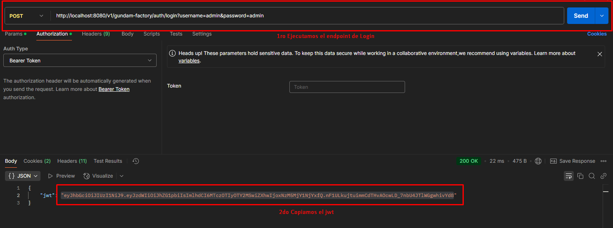

#  Gundam Factory API

La **Gundam Factory API** es una aplicación RESTful que permite la gestión de modelos Gundam, incluyendo su creación, actualización, eliminación y recuperación. Esta API está diseñada para ser escalable, modular y segura, utilizando principios de arquitectura hexagonal y buenas prácticas de desarrollo.

---

##  Tecnologías Utilizadas

- **Java 21** 
- **Spring Boot 3.x** 
- **M2 en memoria** para persistencia de datos 
- **Kafka** para mensajería asíncrona 
- **Spring Security** para autenticación y autorización 
- **JWT (JSON Web Tokens)** para manejo de sesiones seguras 
- **Docker & Docker Compose** para contenerización y despliegue 
- **Swagger/OpenAPI 3.0** para documentación interactiva 

---

##  Dependencias Externas

- **Kafka**: La API depende de un broker de Kafka para la publicación y consumo de eventos relacionados con la fabricación y actualización de Gundams.
    - **Requisito**: Asegúrate de que Kafka está ejecutándose antes de iniciar la API.

---

##  Despliegue con Docker

La API está preparada para ejecutarse en contenedores Docker. Utilizamos `docker-compose` para facilitar la orquestación de la API junto con Kafka y M2.

### 1. **Requisitos Previos**
- Tener **Docker** y **Docker Compose** instalados.

### 2. **Pasos para Levantar la API**

1. Clona el repositorio:
   ```bash
   git clone https://github.com/tkmuller/GundamFactory
   cd gundam-factory-api
   ```

2. Construí la imagen de Docker:
   ```bash
   mvn clean install
   ```


3. Construí la imagen de Docker:
   ```bash
   docker build -t gundam-factory-api .
   ```

4. Levantá los servicios con Docker Compose:
   ```bash
   docker-compose up -d
   ```

Esto levantará la API, M2 y Kafka.

---

##  Roadmap

Esta es la versión **MVP (Producto Mínimo Viable)** de la API. A continuación se detallan las mejoras planificadas:

-  **Implementación de Roles y Permisos Avanzados**: Ampliar la seguridad con permisos por acción.
-  **Soporte para Partes de Gundam y Pilotos**: Extensión del dominio para incluir módulos de personalización.
-  **Eventos en Tiempo Real**: Integración de WebSockets o SSE para notificaciones en tiempo real.
-  **Métricas y Monitoreo**: Integración con Prometheus y Grafana para el monitoreo de la API.
-  **Logs**: Integración con Kibana.

---

##  Endpoints Disponibles

La API expone los siguientes endpoints para la gestión de Gundams:

### 1. **Autenticación**

**POST /v1/auth/login**  
Autentica al usuario y devuelve un JWT para su uso en los demás endpoints.

**Request:**
```bash
curl -X POST http://localhost:8080/v1/auth/login \
  -H "Content-Type: application/json" \
  -d '{"username": "admin", "password": "admin123"}'
```

**Response:**
```json
{
  "token": "eyJhbGciOiJIUzI1NiIsInR5cCI6IkpXVCJ9..."
}
```

---

### 2. **Crear Gundam**

**POST /v1/gundam-factory/gundams**  
Crea un nuevo Gundam en la base de datos.

**Request:**
```bash
curl -X POST http://localhost:8080/v1/gundam-factory/gundams \
  -H "Authorization: Bearer {tu-jwt}" \
  -H "Content-Type: application/json" \
  -d '{
    "name": "RX-78-2 Gundam",
    "model": "RX-78-2",
    "color": "White/Blue/Red",
    "height": 18.0,
    "weight": 60.0,
    "primaryWeapon": "Beam Rifle",
    "secondaryWeapon": "Beam Saber",
    "gundamType": "MULTIPURPOSE",
    "manufacturingDate": "2079-09-18",
    "gundamStatus": "IN_SERVICE"
  }'
```

**Response:**
```json
{
  "id": "60f7c2f3b3e7a5d3e5e6f7a1",
  "name": "RX-78-2 Gundam",
  "model": "RX-78-2",
  "color": "White/Blue/Red"
}
```

---

### 3. **Obtener Gundam por ID**

**GET /v1/gundam-factory/gundams/{id}**  
Recupera los detalles de un Gundam específico.

**Request:**
```bash
curl -X GET http://localhost:8080/v1/gundam-factory/gundams/{id} \
  -H "Authorization: Bearer {tu-jwt}"
```

**Response:**
```json
{
  "id": "60f7c2f3b3e7a5d3e5e6f7a1",
  "name": "RX-78-2 Gundam",
  "model": "RX-78-2",
  "color": "White/Blue/Red"
}
```

---

### 4. **Actualizar Gundam**

**PUT /v1/gundam-factory/gundams/{id}**  
Actualiza la información de un Gundam existente.

**Request:**
```bash
curl -X PUT http://localhost:8080/v1/gundam-factory/gundams/{id} \
  -H "Authorization: Bearer {tu-jwt}" \
  -H "Content-Type: application/json" \
  -d '{
    "name": "RX-78-2 Gundam Updated",
    "color": "Blue/White"
  }'
```

**Response:**
```json
{
  "id": "60f7c2f3b3e7a5d3e5e6f7a1",
  "name": "RX-78-2 Gundam Updated",
  "color": "Blue/White"
}
```

---

### 5. **Eliminar Gundam**

**DELETE /v1/gundam-factory/gundams/{id}**  
Elimina un Gundam de la base de datos.

**Request:**
```bash
curl -X DELETE http://localhost:8080/v1/gundam-factory/gundams/{id} \
  -H "Authorization: Bearer {tu-jwt}"
```

**Response:**
```json
{
  "message": "Gundam eliminado exitosamente"
}
```

---

##  Documentación Interactiva

La API está documentada y disponible para pruebas a través de **Swagger UI**:

- [http://localhost:8080/v1/gundam-factory/swagger-ui/index.html](http://localhost:8080/v1/gundam-factory/swagger-ui/index.html)

Podés autenticarte desde Swagger usando el JWT para acceder a los endpoints protegidos.


Adicionalemente en la Carpeta raiz se encuentra una collection de postman para importarla y probar
desde Postman.



---
 **Gracias por usar la Gundam Factory API!** 

